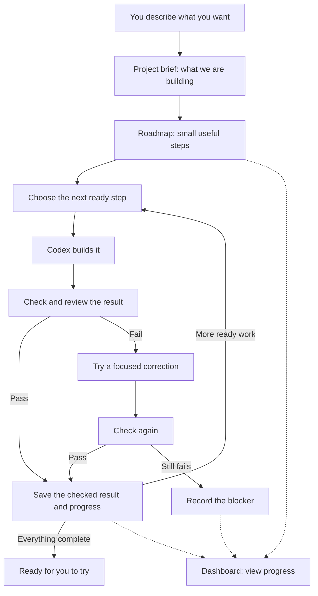

```text
██████╗ ██╗███████╗███████╗
██╔══██╗██║██╔════╝██╔════╝
██████╔╝██║█████╗  █████╗
██╔══██╗██║██╔══╝  ██╔══╝
██║  ██║██║██║     ██║
╚═╝  ╚═╝╚═╝╚═╝     ╚═╝
```

# RIFF for Codex

**Build like a band of six. Ship like one.**

Turn an idea into working software, one checked step at a time.

You describe what you want. RIFF helps Codex keep a clear plan, build it in useful steps, check the result, and remember where to continue. You can follow the work without having to direct every move.

The slogan comes from the original RIFF for Claude Code. Here, Codex coordinates the work and brings in extra help when it is useful.

[Visual field manual](riff-documentation.html) · [Installation](docs/installation.md) · [Everyday use](docs/usage.md) · [How it works](docs/how-it-works.md)

The visual manual is a local HTML page: download or open `riff-documentation.html` in your browser. GitHub shows its source rather than a live preview.

## What RIFF does for you

- **Keeps the goal clear.** A short project brief says what you are building and what matters.
- **Breaks the work into useful steps.** Each step should produce something you can try.
- **Builds and checks.** Codex implements a step, checks it, and reviews the result before recording it as complete.
- **Remembers progress.** You can return later and continue the same project.
- **Keeps useful conventions.** Project taste and stack research guide implementation; frontend work uses design skills and rendered browser checks. See [taste and learn-stack](docs/usage.md#keep-design-and-engineering-conventions).
- **Shows where things stand.** A local dashboard displays the plan, completed work, and anything blocked.

RIFF works with Codex. You still need Codex installed and signed in.

## How the work flows



The brief is saved as `PROJECT.md`; the steps are saved as `ROADMAP.yaml`. The dashboard reads progress. You start the work in Codex.

By default, RIFF continues through ready steps automatically. You can choose **guided** mode if you prefer a pause between steps. Uploading code to GitHub or putting an application online still needs your instruction.

## Which model to use

Start with **Astra Medium** to plan the work and make decisions. Use **Luna X-High** for mechanical work once the task and its checks are clear.

| Work | Model and effort |
| --- | --- |
| Planning, architecture, product decisions, synthesis and final review | Astra Medium |
| Inventories, extraction, defined code changes, test execution and browser checks | Luna X-High |
| A difficult decision that Medium cannot resolve | Astra High for that decision |
| A problem still unresolved at High | Astra X-High for one bounded pass |

Astra also owns visual direction and acceptance. If Luna encounters an unresolved decision, return it to Astra Medium. Return to Medium after an escalation is resolved. Sol has no default role in this policy. Fast is used for Luna only when the runtime exposes it.

These are routing instructions, not an automatic change to the model selected in your current Codex conversation. See the [canonical model routing policy](riff/references/model-routing.md).

## What the latest update changes

- **Completion needs evidence.** A phase must pass executed checks and the required reviews for the exact version being delivered. Required browser or smoke checks need recorded results. Local verification reports make those results inspectable.
- **Codex handles technical observations.** The implementing agent checks warnings before finishing, fixes confirmed problems within scope, and records why an item is resolved or a false positive. Unverified or out-of-scope items stay pending. The dashboard preserves the decisions and their history; a new occurrence reopens the group.
- **Recovery preserves verified work.** Interrupted delivery can reuse evidence that still matches the candidate. Dashboard phase links support both named and numeric identifiers.
- **System hooks avoid duplicate checks.** On a Mac with RIFF's matching system policy already installed, resync removes duplicate project hooks. Other installations keep the ordinary project-hook approval flow.

## Do existing projects need a refresh?

**For this update, run `riff-codex resync` and `riff-codex doctor` once in each connected project**, after its active work finishes. This updates local installation files, including the verification-report exclusion and hook configuration. It preserves the project brief, roadmap and preferences.

Projects linked to the same RIFF checkout already read its updated files; they do not each need a Git pull or a reinstall. Start a fresh Codex session to load the updated skill instructions. For model-routing-only updates, that fresh session is enough when the links are intact. A separately installed plugin or another checkout must be updated separately.

If a dashboard was already running, restart that dashboard process and reload the page to load server changes. See [Update RIFF](docs/installation.md#update-riff) for commands and hook approval details.

## Install

You need **Git**, **Node.js 20 or newer** (which includes npm), and **Bun** for the dashboard and the full installation check. The repository is currently private, so your GitHub account needs access. The [installation guide](docs/installation.md) explains each requirement.

**1. In Terminal, download RIFF once.** Keep this folder in place; your projects will use it.

```sh
git clone https://github.com/alexadark/riff-codex.git ~/riff-codex
cd ~/riff-codex
npm install
npm link
```

**2. In Terminal, connect your project to RIFF.** Replace the example path with your project's folder. It must already use Git; the guide includes the new-folder setup.

```sh
cd /path/to/your-project
riff-codex init
```

Choose your languages, how much explanation you want, and whether RIFF should continue automatically. Press Enter to accept the suggested choices.

**3. Open that project in Codex.** Start a fresh Codex session so it can find the installed RIFF skills. Run `riff-codex doctor`. If it reports system-managed hooks, reload Codex configuration; no individual hook approval is required. Otherwise, open `/hooks`, review and approve RIFF's automatic checks, then record that approval in the project's terminal:

```sh
riff-codex doctor --record-hooks-approved
```

This command records your approval and checks the setup. It does not approve anything for you.

## Start using it

The examples below go **in the Codex conversation**, not Terminal. They use the `$riff:...` names supplied by the RIFF plugin. If those names are unavailable, choose the corresponding RIFF skill from Codex's skill picker; [the installation guide explains the two ways to make skills available](docs/installation.md#make-the-skills-available).

**For a new idea:**

```text
$riff:start I want a simple app where I can save and find my recipes.
```

**For an application that already exists:**

```text
$riff:onboard Understand this app and make a plan for improving it.
```

These prepare the project brief and roadmap. Read them, then start building:

```text
$riff:wave
```

A “wave” means working through the next ready steps. Run the same command when you return to continue unfinished work. If RIFF has recorded a blocker, it needs to be resolved before that work can resume.

## What to ask next

| You want to… | Use in Codex |
| --- | --- |
| See progress and the next step | `$riff:status` |
| Open the dashboard | `$riff:dashboard` |
| Make a small, separate change | `$riff:quick Make the empty screen easier to understand.` |
| Fix something that is broken | `$riff:debug The save button does nothing.` |
| Add a larger improvement to the plan | `$riff:add-phase Let people share a recipe.` |
| Continue building | `$riff:wave` |

You can also open the dashboard from Terminal with `riff-codex dashboard`. It normally opens at `http://127.0.0.1:4000` on your computer.

## Read more when you need it

| Guide | What it answers |
| --- | --- |
| [Visual field manual](riff-documentation.html) | See the whole workflow, explore the diagram, and copy starter commands. |
| [Installation](docs/installation.md) | What do I need? How do I connect a project, update RIFF, or fix setup problems? |
| [Everyday use](docs/usage.md) | What should I type for a new project, existing app, fix, or interruption? |
| [How it works](docs/how-it-works.md) | Who does what? Where does the plan live? How do checks and progress connect? |
| [Technical reference](docs/technical-reference.md) | Which files, checks, and internal rules power RIFF? |

Already using RIFF for Claude Code? Both can share the same project brief and roadmap. Use only one of them to work on a given step at a time. [See the coexistence details](docs/technical-reference.md#using-riff-with-claude-code).
