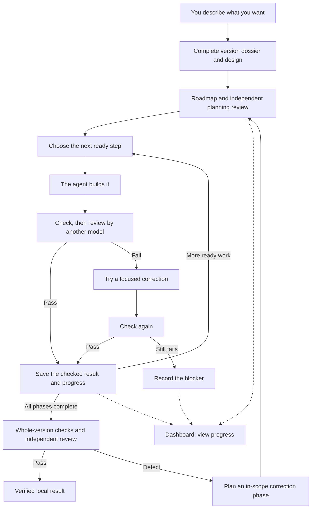

```text
██████╗ ██╗███████╗███████╗
██╔══██╗██║██╔════╝██╔════╝
██████╔╝██║█████╗  █████╗
██╔══██╗██║██╔══╝  ██╔══╝
██║  ██║██║██║     ██║
╚═╝  ╚═╝╚═╝╚═╝     ╚═╝
```

# RIFF

**Build like a band of six. Ship like one.**

Turn an idea into working software, one checked step at a time, in **Claude Code** or **Codex**.

You describe what you want. RIFF helps your coding agent keep a clear plan, build it in useful steps, have another model review the result, and remember where to continue. You can follow the work without having to direct every move.

RIFF runs in two coding tools, called hosts: Claude Code and Codex. Connecting a project sets it up for both, so you can switch hosts without reinstalling. The slogan comes from the original RIFF framework; here, the agent in your host coordinates the work and brings in extra help when it's useful.

[Visual field manual](https://riff-codex-doc.vercel.app) · [Installation](docs/installation.md) · [Everyday use](docs/usage.md) · [Model advice](docs/model-advice.md) · [How it works](docs/how-it-works.md)

The visual manual is available online at [riff-codex-doc.vercel.app](https://riff-codex-doc.vercel.app).

## What RIFF does for you

- **Plans the committed version.** A product brief indexes stories, journeys, data and architecture contracts, wireframes, design references, risk checks and acceptance criteria.
- **Breaks the work into useful steps.** Each step should produce something you can try.
- **Builds and checks.** The agent implements a step, checks it, and gets an independent review before recording it as complete.
- **Has another model review the work.** `riff review run` asks a model from another family, GPT-6 Astra by default, to attack each phase, dossier and final version read-only.
- **Remembers progress.** You can return later, in either host, and continue the same project.
- **Keeps useful conventions.** Project taste and stack research guide implementation; frontend work uses design skills and rendered browser checks. See [taste and learn-stack](docs/usage.md#keep-design-and-engineering-conventions).
- **Shows where things stand.** A local dashboard displays the plan, completed work, reviews, and anything blocked.

You still need Claude Code or Codex installed and signed in. The Codex CLI is recommended in both cases, since it runs the default reviewer.

## How the work flows


```mermaid
flowchart TD
    You[You describe what you want] --> Brief[Complete version dossier and design]
    Brief --> Plan[Roadmap and independent planning review]
    Plan --> Pick[Choose the next ready step]
    Pick --> Build[The agent builds it]
    Build --> Check[Check, then review by another model]
    Check -->|Pass| Save[Save the checked result and progress]
    Check -->|Fail| Fix[Try a focused correction]
    Fix --> CheckAgain[Check again]
    CheckAgain -->|Pass| Save
    CheckAgain -->|Still fails| Stop[Record the blocker]
    Save -->|More ready work| Pick
    Save -->|All phases complete| Final[Whole-version checks and independent review]
    Final -->|Pass| Done[Verified local result]
    Final -->|Defect| Correction[Plan an in-scope correction phase]
    Correction --> Plan
    Plan -.-> View[Dashboard: view progress]
    Save -.-> View
    Stop -.-> View
```

The brief is saved as `PROJECT.md`; the steps are saved as `ROADMAP.yaml`. For production applications, `start` prepares the complete version dossier and an independent planning review before implementation. ASCII wireframes can be handed to another design model; its returned reference and tokens become part of the dossier. The dashboard reads progress. You start the work in Claude Code or Codex.

By default, RIFF continues through ready steps automatically. You can choose **guided** mode if you prefer a pause between steps. Uploading code to GitHub or putting an application online still needs your instruction.

## Optional model advice

RIFF can advise which available model and reasoning effort fit a task. Ask in ordinary language before a RIFF request or phase:

```text
Before you start this RIFF phase, advise which model and reasoning effort fit it.
Do not begin the work or change models.
```

RIFF leaves the primary model selected in your host unchanged. During a wave it also advises profiles for the already planned subagents; the coordinating agent applies verified profiles through native launch tools when delegation is authorized. Under Claude Code, each Anthropic profile is installed as a subagent with its model and effort fixed, such as `riff:sonnet-5-5-medium`. A plan does not itself start work, create workers, or pause a loop. The model actually used remains `unknown` unless the runtime or the user supplies evidence.

The default `local` mode means the current agent applies RIFF's portable profile catalogue. It does not mean on-device inference. Optional `jev` mode sends only a curated decision summary to Jev through OpenRouter and requires an explicit project opt-in. OpenAI models continue to use the Codex subscription; conditional DeepSeek profiles use Ollama Cloud and are a separate form of consumption.

As a guide, Luna fits bounded work, Sol fits well-scoped work with several connected steps, and Astra fits planning or long runs with costly dependencies. On the Anthropic side, Haiku fits simple reading, Sonnet bounded changes and exploration, and Opus the default for coding and long work. High and XHigh reasoning are for a concrete difficulty, not task length alone. These are decision hypotheses, not measured success rates. See [model advice](docs/model-advice.md) for modes, privacy controls, natural-language examples, and the advanced CLI.

## What the latest update changes

- **RIFF runs in Claude Code.** `riff init` now sets up a project for Claude Code and Codex together. In Claude Code, skills are called as `/riff:wave`, model profiles are installed as subagents, and RIFF's context is injected when a session starts, resumes, or restarts after `/clear` or a compaction. Compaction is set to 400,000 tokens for the project. See [installation](docs/installation.md#use-riff-in-claude-code).
- **The command is now `riff`.** `riff-codex` remains an alias. Project state moves from `.riff-codex-state/` to `.riff-data/` on the next `riff resync`, with a backup.
- **Another model reviews the work.** `riff review run` has GPT-6 Astra attack each phase, dossier and final version read-only through the Codex CLI, with GPT-6.1 Sol and then a fresh Claude session as fallbacks when a reviewer can't run. The receipt names the reviewer that really ran. Security findings are corrected without stopping the wave; points that need an expert ship with a documented interim decision and are listed at the end. See [independent reviews](docs/installation.md#independent-reviews).
- **Planning has a readiness gate.** New production application plans include a manifest of their contracts, diagrams and design references. A content-bound independent review must match that dossier before implementation begins. Existing projects aren't silently enrolled.
- **Phases keep a durable checkpoint.** The host's own compaction stays in use; RIFF doesn't relaunch the host or claim to reset a conversation. Checkpoints and targeted reference loading support recovery without the previous chat.
- **Parallel work has boundaries.** Independent implementation packages use separate worktrees inside one active phase. The primary agent integrates and verifies the assembled result. Independent reviews can run in parallel on a frozen candidate.
- **The whole version is checked.** After per-phase verification, the agent exercises the connected journeys and obtains an independent delivery review. Corrections follow the normal phase gates.
- **Completion needs evidence.** A phase must pass executed checks and the required reviews for the exact version being delivered. Required browser or smoke checks need recorded results. Local verification reports make those results inspectable.
- **The agent handles observations every phase.** It fixes confirmed problems within scope and records verified dispositions. Enrolled projects require explicit follow-up phases for nonblocking pending items; HIGH and CRITICAL findings are corrected before completion, except security points that need an expert, which get a documented interim decision. The dashboard preserves decisions and reopens new occurrences.
- **Existing products can evolve deliberately.** `evolve` challenges a requested change against the current application, updates only the affected plan, and stops at planning readiness. `wave` remains the separate implementation step.
- **Fewer, broader skills.** `onboard` now includes mapping, `debug` covers live incidents, and `start` covers promotion of a prototype to production. The former `map`, `incident` and `promote` skills are gone.

## Do existing projects need a refresh?

**For this update, run `riff resync` and `riff doctor` once in each connected project**, after its active work finishes. This updates local installation files for both hosts, moves the project state to `.riff-data/` with a backup, and preserves the project brief, roadmap and preferences. If a phase is still active, `resync` waits to move the state and says so.

Projects linked to the same RIFF checkout already read its updated files; they don't each need a Git pull or a reinstall. Start a fresh session to load the updated skill instructions. A separately installed plugin or another checkout must be updated separately.

To use Claude Code, also register the plugin marketplace once per computer, as shown in [Install](#install). If a dashboard was already running, restart that dashboard process and reload the page to load server changes. See [Update RIFF](docs/installation.md#update-riff) for commands and hook approval details.

## Install

You need **Git**, **Node.js 20 or newer** (which includes npm), **Bun** for the dashboard and the full installation check, and **Claude Code** or **Codex**. The repository is currently private, so your GitHub account needs access. The [installation guide](docs/installation.md) explains each requirement.

**1. In Terminal, download RIFF once.** Keep this folder in place; your projects will use it.

```sh
git clone https://github.com/alexadark/riff-codex.git ~/riff-codex
cd ~/riff-codex
npm install
npm link
```

**2. For Claude Code, register the plugin once per computer.** Skip this if you only use Codex.

```sh
claude plugin marketplace add ~/riff-codex/riff
```

**3. In Terminal, connect your project to RIFF.** Replace the example path with your project's folder. It must already use Git; the guide includes the new-folder setup.

```sh
cd /path/to/your-project
riff init
```

Choose your languages, how much explanation you want, and whether RIFF should continue automatically. Press Enter to accept the suggested choices. Then check the setup:

```sh
riff doctor
```

**4. Open the project in your host.**

- **Claude Code:** start a new session in the project. Claude Code installs the RIFF plugin on the first session, and the hooks are already declared in `.claude/settings.local.json`.
- **Codex:** start a fresh session so it finds the installed RIFF skills. If `riff doctor` reports system-managed hooks, reload Codex configuration; no individual hook approval is required. Otherwise, open `/hooks`, review and approve RIFF's automatic checks, then record that approval in the project's terminal with `riff doctor --record-hooks-approved`. This records your approval and checks the setup; it doesn't approve anything for you.

**5. Recommended: sign the Codex CLI in to ChatGPT** with `codex login`, even if you build in Claude Code. It runs the default reviewer. Without it, reviews fall back to a fresh Claude session, labeled same-family.

## Start using it

The examples below go **in the conversation**, not Terminal. Claude Code uses `/riff:...` and Codex uses `$riff:...`; the skills are the same. In Codex, if those names are unavailable, choose the corresponding RIFF skill from the skill picker; [the installation guide explains the two ways to make Codex skills available](docs/installation.md#use-riff-in-codex).

**For a new idea:**

```text
/riff:start I want a simple app where I can save and find my recipes.
```

**For an application that already exists:**

```text
/riff:onboard Map the current application and establish its existing behavior as the RIFF baseline.
/riff:evolve Plan how to make finding a recipe easier.
```

Production `start` prepares and reviews the complete dossier, including design before building. `onboard` maps the application and preserves its documents and behavior. Once preparation is complete, start building:

```text
/riff:wave
```

A “wave” means working through the next ready steps. Run the same command when you return to continue unfinished work. If RIFF has recorded a blocker, it needs to be resolved before that work can resume.

### Branches and pull requests

RIFF keeps one branch and one PR for a coherent evolution or initial version across successive waves. When you authorize publication, it opens a draft after the first validated phase and updates that same PR as later phases complete. In `loop`, creating a PR doesn't pause work; `guided` keeps its existing between-phase pauses. After whole-version verification and `finish --check`, RIFF marks the PR ready for review and returns its verified URL. Merge and deployment require their own authorization.

Without publication authorization, RIFF completes local work and prepares the PR description before requesting delivery. A standalone `quick` change follows the same branch/PR workflow with its bounded checks. The skills perform Git and GitHub operations; the CLI verification commands don't push or create PRs themselves. See the [Git delivery contract](riff/references/git-delivery.md) for resume and concurrent-work rules.

For an existing application that isn't connected to RIFF, the complete path is explicit:

```text
riff init                       # Terminal, once for this project
/riff:onboard                   # Conversation: map the system and establish the baseline
/riff:evolve Add team invitations while preserving individual accounts.
/riff:wave                      # Conversation: implement the reviewed plan
```

`onboard` inspects the current system and, when the map will be reused, saves it as `.riff-data/MAP.md`. It records the existing behavior as a baseline; it doesn't invent historical delivery phases. If the application is already onboarded, use `evolve` directly for a product change that needs reconsideration or affects more than one future phase. Evolve analyzes the current code, data and access boundaries, preserves completed and active phase contracts, and ends at planning readiness. It never starts a wave itself.

## What to ask next

| You want to… | Claude Code | Codex |
| --- | --- | --- |
| See progress and the next step | `/riff:status` | `$riff:status` |
| Open the dashboard | `/riff:dashboard` | `$riff:dashboard` |
| Make a small, separate change | `/riff:quick Make the empty screen easier to understand.` | `$riff:quick ...` |
| Fix something that is broken | `/riff:debug The save button does nothing.` | `$riff:debug ...` |
| Add one already-clear outcome | `/riff:add-phase Let people share a recipe.` | `$riff:add-phase ...` |
| Reconsider an existing product change | `/riff:evolve Let recipe owners invite teammates.` | `$riff:evolve ...` |
| Continue building | `/riff:wave` | `$riff:wave` |

You can also open the dashboard from Terminal with `riff dashboard`. It normally opens at `http://127.0.0.1:4000` on your computer.

## Read more when you need it

| Guide | What it answers |
| --- | --- |
| [Visual field manual](https://riff-codex-doc.vercel.app) | See the whole workflow, explore the diagram, and copy starter commands. |
| [Installation](docs/installation.md) | What do I need? How do I connect a project in each host, set up reviews, update RIFF, or fix setup problems? |
| [Everyday use](docs/usage.md) | What should I type for a new project, existing app, fix, or interruption? |
| [Model advice](docs/model-advice.md) | How do I ask for advice, choose a mode, and understand what was actually selected? |
| [How it works](docs/how-it-works.md) | Who does what? Where does the plan live? How do checks, reviews and progress connect? |
| [Technical reference](docs/technical-reference.md) | Which files, checks, and internal rules power RIFF? |

Already using the original RIFF framework, with its `.riff` and `.riff-state/` folders? Both can share the same project brief and roadmap. Use only one of them to work on a given step at a time. [See the coexistence details](docs/technical-reference.md#coexisting-with-the-original-riff-framework).
