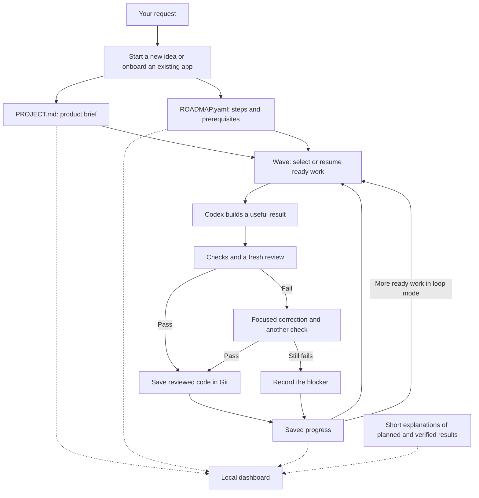

# How RIFF works

[Back to the README](../README.md) · [Visual field manual](../riff-documentation.html)

RIFF gives Codex a shared plan and a way to keep track of checked work. Codex still does the thinking, uses tools, changes the application, and reviews results.

## Follow one request

Imagine you ask for an app that saves recipes.

1. **Describe the result.** You want to save a recipe and find it when cooking.
2. **Write the brief.** RIFF records who the app is for, what matters, and what is outside the current scope in `PROJECT.md`.
3. **Break it into useful steps.** `ROADMAP.yaml` might start with saving and retrieving a recipe, followed by search. Work that needs an earlier step waits for it.
4. **Build the next ready step.** `$riff:wave` asks Codex to implement the highest-priority step whose prerequisites are complete.
5. **Check and review it.** Saving a recipe should produce a recipe you can retrieve. The evidence should match the promised result. Sensitive changes also need a focused security review.
6. **Save the result.** RIFF records completion and the reviewed code is saved in a local Git commit. The dashboard can show the result.
7. **Continue.** Loop mode moves to the next ready step. Guided mode pauses between steps.

## Where information goes

Solid arrows show the working cycle. Dotted arrows show information being displayed. The dashboard does not send instructions back to Codex.

## Who does what

| Part | Its job |
| --- | --- |
| You | Set the goal, correct the direction, and authorize publication when wanted. |
| Codex | Understand the request, build the change, use tools, and coordinate useful help. |
| RIFF | Keep the plan, readiness rules, checks, and saved progress consistent. |
| Project brief | Explain what the product should do and its boundaries. |
| Roadmap | List useful steps, their priorities, and what must happen first. |
| Checks and review | Supply evidence that the changed behavior meets the request. |
| Git | Keep the reviewed code changes in local history. |
| Dashboard | Display the plan and progress in one place. |

The original “band of six” slogan is RIFF's signature. RIFF Codex does not require a fixed team of six agents on every request.

## What “done” means

A planned step is not work started. A running step is not work completed. RIFF records completion only after the required checks and reviews pass and the reviewed changes have been committed.

A local result also has a specific scope: it does not prove that an outside service is configured or that a website has been published. Those outcomes need their own evidence when they are part of the request.

## What happens when a check fails

During building, Codex can correct ordinary errors. Once RIFF records a formal failed check, the workflow permits a focused correction and one repeat of that check. If it still fails, RIFF records the blocker. Independent ready work may continue when that blocker does not affect it.

The saved state is managed by RIFF's commands. Do not edit the progress files manually to make a step look complete.

## What stays between sessions

`PROJECT.md` and `ROADMAP.yaml` live with your application. Local progress, check records, and short dashboard explanations live in `.riff-codex-state/`.

That local state is excluded from Git. It supports returning to the same working folder; it is not a cloud backup or a promise that another computer will automatically resume the identical session.

[See the file and command reference](technical-reference.md) for the implementation details.
