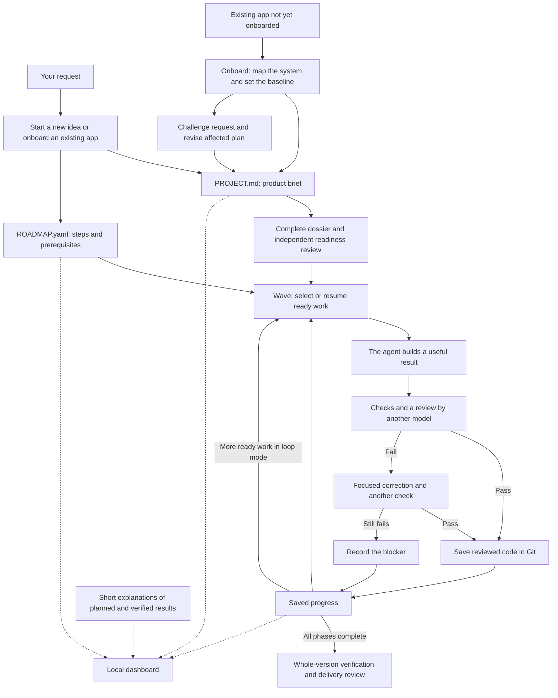

# How RIFF works

[Back to the README](../README.md) · [Visual field manual](../riff-documentation.html)

RIFF gives your coding agent a shared plan and a way to keep track of checked work. It runs in two hosts, Claude Code and Codex. The agent in your host still does the thinking, uses tools and changes the application; another model reviews the results.

## Follow one request

Imagine you ask for an app that saves recipes.

1. **Describe the result.** You want to save a recipe and find it when cooking.
2. **Design the committed version.** `PROJECT.md` indexes the stories, wireframes, design references, data model, architecture, decisions and verification criteria. RIFF checks risky assumptions with bounded probes.
3. **Review the plan.** `ROADMAP.yaml` connects useful phases to stories. The finished dossier, including visual references for a UI application, receives an independent review before implementation.
4. **Build the next ready step.** The wave skill (`/riff:wave` in Claude Code, `$riff:wave` in Codex) asks the agent to implement the highest-priority step whose prerequisites are complete.
5. **Check and review it.** Saving a recipe should produce a recipe you can retrieve. The evidence should match the promised result. `riff review run` then asks a model from another family to attack the change read-only. Sensitive changes also need a focused security review.
6. **Save the result.** RIFF records completion and the reviewed code is saved in a local Git commit. The dashboard can show the result.
7. **Continue.** Loop mode moves to the next ready step. Guided mode pauses between steps.
8. **Verify the whole version.** The agent checks connected journeys on the integrated result and obtains an independent final review. Any remaining in-scope correction follows the phase validation path.

For an existing application, the path is explicit: install RIFF, onboard the baseline, evolve a requested product change when it needs reconsideration, then wave the reviewed plan. `onboard` maps the current system, saves that map for reuse, and describes existing capabilities without inventing retrospective phases. `evolve` checks the current code, data and access boundaries, challenges the need, supports related requests, and revises only affected future contracts. It preserves completed and active phase contracts and stops at planning readiness; it never activates a wave.

## Where information goes

```mermaid
flowchart TD
    Request[Your request] --> Shape[Start a new idea or onboard an existing app]
    Shape --> Brief[PROJECT.md: product brief]
    Shape --> Roadmap[ROADMAP.yaml: steps and prerequisites]
    Existing[Existing app not yet onboarded] --> Onboard[Onboard: map the system and set the baseline]
    Onboard --> Brief
    Onboard --> Evolve[Challenge request and revise affected plan]
    Evolve --> Brief
    Brief --> Ready[Complete dossier and independent readiness review]
    Ready --> Wave[Wave: select or resume ready work]
    Roadmap --> Wave
    State[Saved progress] --> Wave
    Wave --> Agent[The agent builds a useful result]
    Agent --> Verify[Checks and a review by another model]
    Verify -->|Pass| Commit[Save reviewed code in Git]
    Verify -->|Fail| Repair[Focused correction and another check]
    Repair -->|Pass| Commit
    Repair -->|Still fails| Block[Record the blocker]
    Commit --> State
    Block --> State
    State -->|More ready work in loop mode| Wave
    State -->|All phases complete| Final[Whole-version verification and delivery review]
    Brief -.-> Board[Local dashboard]
    Roadmap -.-> Board
    State -.-> Board
    Explain[Short explanations of planned and verified results] -.-> Board
```

Solid arrows show the working cycle. Dotted arrows show information being displayed. The dashboard doesn't send instructions back to the agent.

## Who does what

| Part | Its job |
| --- | --- |
| You | Set the goal, correct the direction, and authorize publication when wanted. |
| Your host's agent | Claude Code or Codex. Understand the request, build the change, use tools, and coordinate useful help. |
| Reviewer | Another model, run read-only by `riff review run`, that attacks each phase, dossier and final version. |
| RIFF | Keep the plan, readiness rules, checks, and saved progress consistent. |
| Project brief | Explain what the product should do and its boundaries. |
| Roadmap | List useful steps, their priorities, and what must happen first. |
| Checks and review | Supply evidence that the changed behavior meets the request. |
| Git | Keep the reviewed code changes in local history. |
| Dashboard | Display the plan and progress in one place. |

The original “band of six” slogan is RIFF's signature. RIFF doesn't require a fixed team of six agents on every request.

The primary agent can delegate independent packages within a phase. Concurrent writers use separate worktrees and return changes for integration. Reviews can run in parallel on the same frozen candidate. A single owner coordinates phase state, architecture and final acceptance.

## How product changes are replanned

The `evolve` skill is a planning boundary for an existing product. It reads the current baseline and relevant evidence, then compares the requested outcome with what the application actually does. The analysis covers affected journeys, screens and states, data and migrations, permissions and tenancy, integrations, and operational behavior. It records what existing users retain and what changes.

One evolve request may contain several related requests. RIFF identifies shared outcomes and conflicts before changing the plan. It updates affected specifications and future roadmap phases only, preserves completed history and active contracts, and repoints dependencies before synchronization. A pending replacement may remove only an unreferenced phase that has never started; the plan records the old-to-new mapping. Work beyond the version remains in existing exclusions with a reason.

Evolve checks readiness according to the project's enrollment. A legacy onboarded project may receive a bounded evolution without silent enrollment. A complete-version request uses the full discovery dossier and independent review. An enrolled project's changed dossier needs a fresh review and discovery check. Evolve ends at planning readiness, so a separate `wave` request is required to activate implementation.

## What “done” means

A planned step is not work started. A running step is not work completed. RIFF records completion only after the required checks and reviews pass and the reviewed changes have been committed.

For projects enrolled by the discovery manifest, the dossier's review must match its current files, each phase needs a current checkpoint and observation dispositions, and final delivery needs an independent review of the assembled version. These gates check evidence integrity; they cannot establish the truth of an unperformed test or an invented reviewer identity.

A local result also has a specific scope: it does not prove that an outside service is configured or that a website has been published. Those outcomes need their own evidence when they are part of the request.

## Who reviews the work

The agent that wrote the code never reviews it alone. `riff review run --type discovery|functional|security|delivery` builds an adversarial prompt from the phase criteria and the diff, then runs a reviewer read-only on the frozen candidate. It tries a chain in order: GPT-6 Astra through the Codex CLI, GPT-6.1 Sol, then a fresh Claude session. It moves on only when a reviewer can't run (CLI missing, not signed in, model unavailable, quota, timeout, or output that stays invalid after one retry). A negative review is a result, never a reason to try the next reviewer.

The bridge writes the review to `.riff-data/reviews/` and prints the command that records it. The agent runs that command itself, so the receipt names the reviewer that actually ran, the reviewers skipped and why, and whether it belongs to the same model family as the builder. A HIGH or CRITICAL finding always fails the review, and a failed review can't be repeated on an unchanged candidate. A dossier gets three failed rounds at most before RIFF records a blocker.

Security findings are corrected during the wave and reviewed again; they don't stop it. A point that needs a security expert's judgment, such as a threat model or an infrastructure choice, is recorded as `expert_review` with the most cautious interim decision that keeps the app working. It doesn't block phases or delivery, later reviewers are told about it, and `riff finish --check` lists it for the final report.

## What happens when a check fails

During building, the agent can correct ordinary errors. Once RIFF records a formal failed check, the workflow permits a focused correction and one repeat of that check. If it still fails, RIFF records the blocker. Independent ready work may continue when that blocker does not affect it.

The saved state is managed by RIFF's commands. Do not edit the progress files manually to make a step look complete.

## What stays between sessions

`PROJECT.md` and `ROADMAP.yaml` live with your application. Local progress, check and review records, and short dashboard explanations live in `.riff-data/`.

Checkpoints record the candidate, evidence and next action; the dossier preserves lasting decisions. The agent reloads only the current phase's relevant references. The host's own compaction manages conversation size. In Claude Code, RIFF sets compaction at 400,000 tokens for the project, and a hook injects the active phase, its checkpoint and the next action again after a compaction or `/clear`. RIFF doesn't clear the conversation, start a new session for every phase, or automatically relaunch a stopped process.

That local state is excluded from Git. It supports returning to the same working folder; it is not a cloud backup or a promise that another computer will automatically resume the identical session.

[See the file and command reference](technical-reference.md) for the implementation details.
